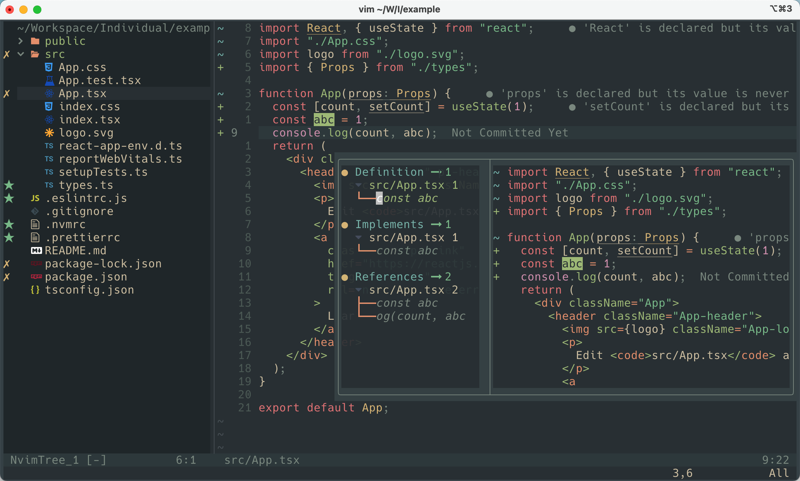

## Screenshot



## Fish shell

Install [ fish ](https://github.com/fish-shell/fish-shell) shell

```bash
brew install fish
```

Check your path of fish:
```bash
which fish
# e.g. -> /opt/homebrew/bin/fish
```

Set fish as your default shell in terminal with your path of fish:
```bash
chsh -s /opt/homebrew/bin/fish
```

If fish is not configed in your shell bin, just add it in:
```bash
echo /opt/homebrew/bin/fish | sudo tee -a /etc/shells 
```

Then, restart your terminal.

If your fish shell is ready, then install [fisher](https://github.com/jorgebucaran/fisher), the packages manager in fish:
```bash
curl -sL https://raw.githubusercontent.com/jorgebucaran/fisher/main/functions/fisher.fish | source && fisher install jorgebucaran/fisher
```

Once fisher is ready, then install `nvm` to manage your node version:
```bash
fisher install jorgebucaran/nvm.fish
```

Of course, we can set default node version  and default packages.
Here I use `v16.19.0` as my default node version.
And these packages below are **ALL** needed in my nvim config.
```bash
set --universal nvm_default_version v16.19.0
set --universal nvm_default_packages nrm open@8.4.2 neovim typescript typescript-language-server @tailwindcss/language-server eslint_d vscode-langservers-extracted
```

## iTerm2 theme

1. Download source of colorscheme from [Gogh](https://github.com/Gogh-Co/Gogh)
2. Install `Everforest Dark`
3. Open iTerm2 preferences by `<Command>,`
4. Set `Profiles` > `Colors` > `Color Presets` with `Everforest Dark`

## Neovim

Install `neovim` by brew and some dependencies used later
```bash
brew install neovim ripgrep fd
```

Alias `vim` to `nvim` by setting in fish
```bash
echo "alias vim nvim" > ~/.config/fish/aliases.fish
```

Then write `. ~/.config/fish/aliases.fish` to the top of `~/.config/fish/config.fish` and restart your termianal again. Now your can use `vim` directly.

Download this project:
```bash
git clone https://github.com/Xiaobo2020/dotfiles-nvim.git ~/.config/nvim
```

Install [Packer.nvim](https://github.com/wbthomason/packer.nvim)
```bash
git clone --depth 1 https://github.com/wbthomason/packer.nvim\
 ~/.local/share/nvim/site/pack/packer/start/packer.nvim
```

Open `~/.config/nvim/init.lua` by `vim`, then
1. run `:PackerInstall`
2. run `:Mason`
3. Once everything is ready, run `:checkhealth` to verify status
```bash
vim ~/.config/nvim/init.lua
```

Fix error caused by highlights.scm of treesitter
```bash
cd ~/.local/share/nvim/site/pack/packer/start/nvim-treesitter/queries/vim/
mv highlights.scm highlights.scm.bak
```

## Keymaps

Leader key: `" "`

| Mode | Shotcut | Keymap | Description |  
|------|---------|--------|-------------|
| `i` | `jk` | `<ESC>` | 退出insert模式 |
| `v` | `J` |  | 单行或多行向下移动 |
| `v` | `K` |  | 单行或多行向下移动 |
| `n` | `<leader>nh` |  | 取消搜索引起的高亮显示 |
| `n` | `<C-a>` |  | 全选 |
| `n` | `<leader>e` |  | 打开/关闭NvimTree |
| `n` | `<leader>sv` |  | 水平分屏 |
| `n` | `<leader>sh` |  | 垂直分屏 |
| `n` | `<C-h>` |  | 向左切换分屏 |
| `n` | `<C-l>` |  | 向右切换分屏 |
| `n` | `<C-j>` |  | 向下切换分屏 |
| `n` | `<C-k>` |  | 向上切换分屏 |
| `n` | `<C-w><left>` |  | 垂直分屏线左移 |
| `n` | `<C-w><right>` |  | 垂直分屏线右移 |
| `n` | `<C-w><up>` |  | 水平分屏线上移 |
| `n` | `<C-w><down>` |  | 水平分屏线下移 |
| `n` | `<leader>te` |  | 创建Tab |
| `n` | `<Tab>` |  | 切换下一个Tab |
| `n` | `<S-Tab>` |  | 切换上一个Tab |
| `n` | `<leader>mp` |  | 打开MarkdownPreview |
| `n` | `<leader>ms` |  | 关闭MarkdownPreview |
| `n` | `<leader>do` |  | 打开GitDiffView |
| `n` | `<leader>dc` |  | 关闭GitDiffView |
| `n` | `<leader>dh` |  | 展示当前文件Git历史 |
| `n` | `<leader>db` |  | 展示当前分支Git历史 |
| `n` | `<leader>ff` |  | 打开Telescope进行基于文件名的搜索 |
| `n` | `<leader>fd` |  | 打开Telescope进行基于当前文件路径的搜索 |
| `n` | `<leader>fg` |  | 打开Telescope进行基于内容的搜索 |
| `n` | `<leader>fb` |  | 打开Telescope进行基于Buffer的搜索 |
| `n` | `<leader>fh` |  | 打开Telescope进行基于Help Tag的搜索 |
| `n` | `<leader>tt` |  | 打开Floating terminal |
| `n` | `<leader>jn` |  | 显示下一个Diagnostic提示 |
| `n` | `<leader>jp` |  | 显示上一个Diagnostic提示 |
| `n` | `<leader>l` |  | 显示当前行的Diagnostic提示 |
| `n` | `<leader>h` |  | 显示当前行的文档信息提示 |
| `n` | `<leader>ca` |  | 显示code action |
| `n` | `<leader>ol` |  | 显示当前文件的大纲 |
| `n` | `gd` |  | go to definition |
| `n` | `gt` |  | go to type definition |
| `n` | `gp` |  | peek definition |
| `n` | `gr` |  | rename variable |
| `n` | `<C-c>` |  | Quit when rename variable |
| `n` | `gf` |  | show definitions & implements & references |
| `n` | `<leader>rf` |  | Typescript - rename file |

